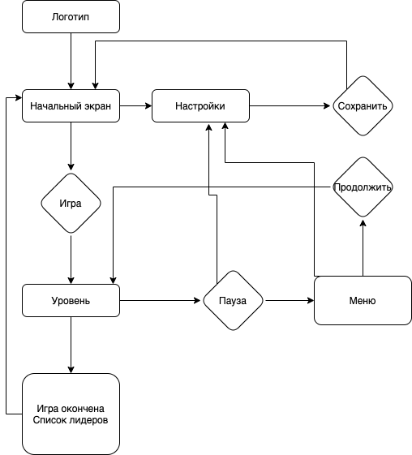

# Yandex Praktikum Helsinki Team Asteroids

---

**_Here we go_** with Asteroids game from [Yandex](https://yandex.ru/) Practicun Helsinki Team. <br>
In this project our team will create game similar to Asteroids (1979). Our main goal is to build
our team app and improve our skills. 

## Install

---

To install the app you should download repo and run
```
> npm install
```
or 
```
> yarn install
```

## Available commands

---

###`npm start`

Runs the app in developer mode. You can access dev server on https://localhost:3000.

###`npm run build`
Builds the app for production.

###`npm eslint`
Checks the app for syntax errors.

## Heroku

The app will be deployed to Heroku soon, and link will be placed here.

## Game Description

Asteroids (battle for Helsinki)

за основу взята atari-asteroids:

https://games.aarp.org/games/atari-asteroids

Игра представляет из себя поле с кораблем игрока и летящими астероидами.
Задача игрока: сбивать астероиды и набрать как можно большее количество очков. Игра заканчивается, когда корабль встретится с астероидом.

Действия игрока:
###
	- Поворачивать корабль вправо влево
	- Движение вперёд
	- Стрельба

Объекты:
### 
    - Корабль:
        Корабль с включенным двигателем (Игрок делает “вперёд”)
        (Корабль с включенным форсажем (Фиксировать как долго игрок зажимает "вперёд", после определенного количества времени увеличивается скорость движения, увеличивается расстояние, на которое смещается корабль))`
	- Снаряд: Игрок делает “выстрел” (снаряду задаётся такой же вектор движения, как у корабля в момент выстрела)
	- Астероид: (двигается по полю в случайном направлении)


Взаимодействие объектов:
###
	- Снаряд попадает в астероид, снаряд и астероид исчезают (астероид распадается на мелкие астероиды) игрок увеличивает очки.
	- Астероид попадает в корабль, игра закончена, отображается таблица с результатом.

Все объекты за исключением корабля исчезают, если выходят за пределы поля. 


		 

